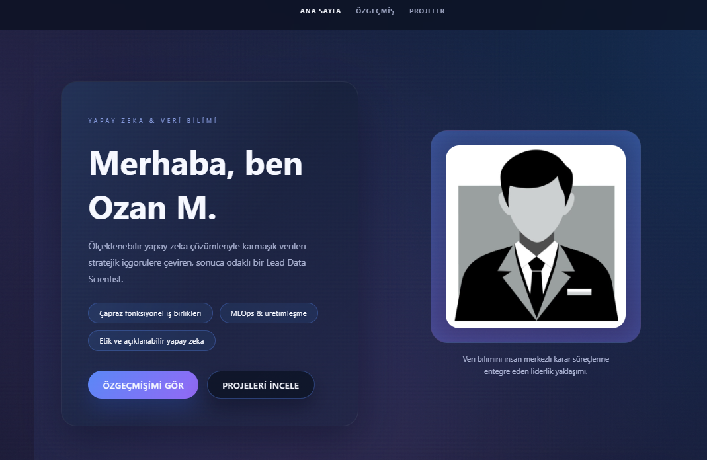
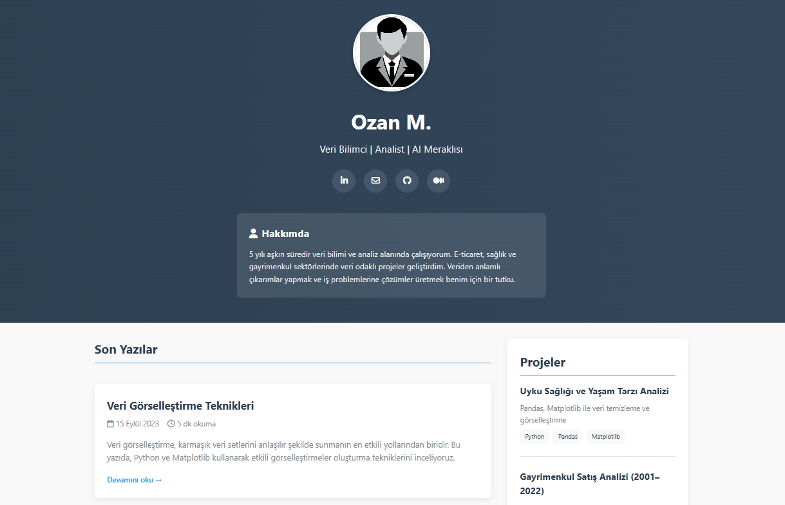
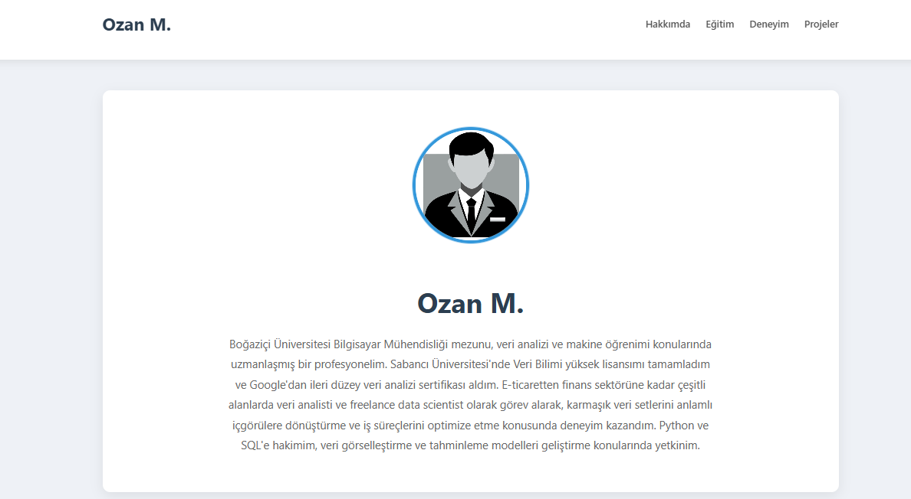
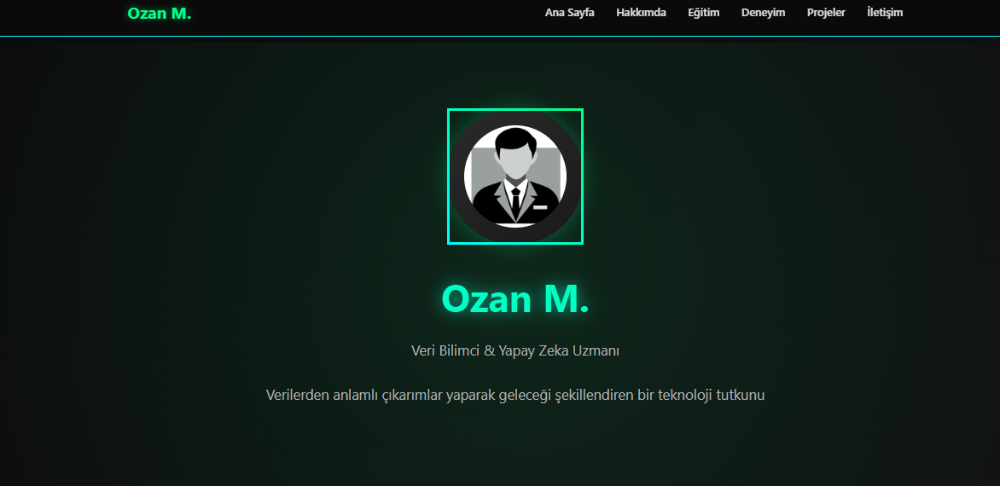
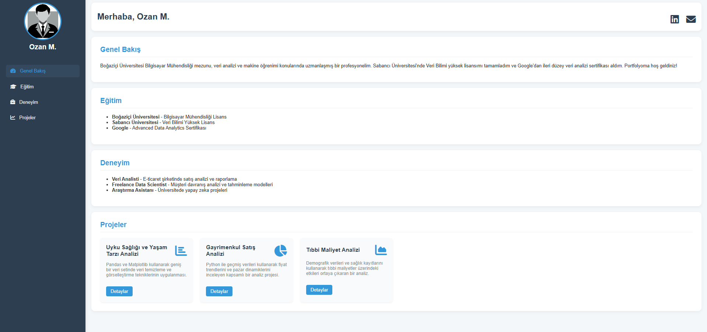
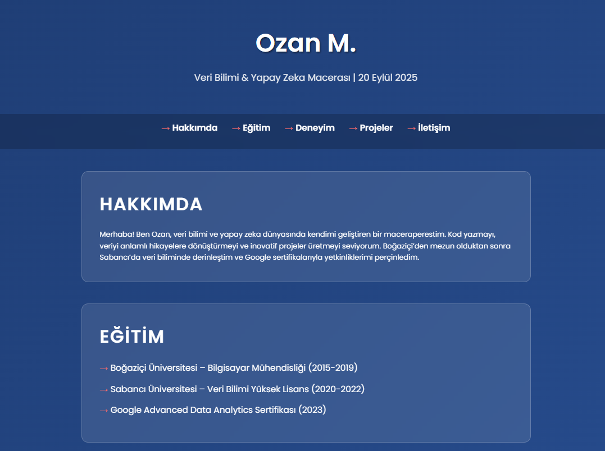
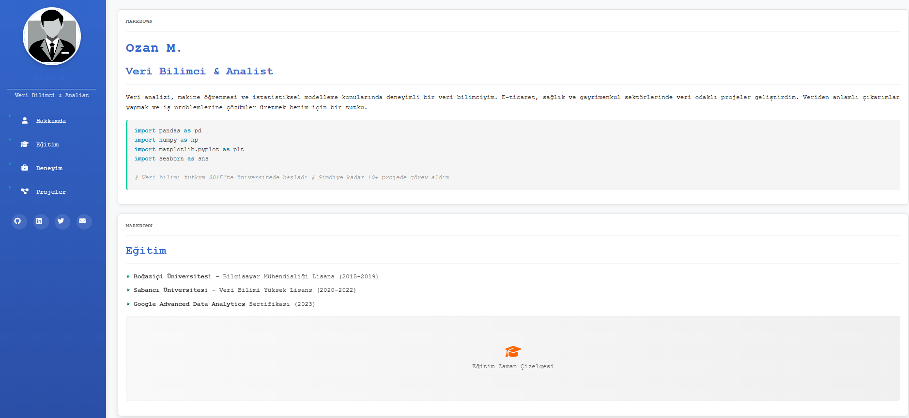
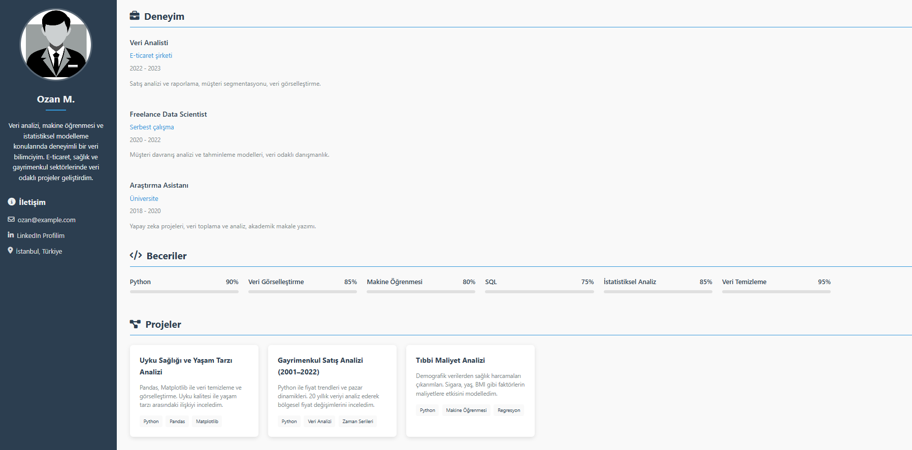

# 🚀 AI Portfolio Hub

Profesyonel **AI ve Data Science odaklı portfolyo şablonları** koleksiyonu. Modern tasarımlar, responsive yapı ve kolay özelleştirme ile hızlıca etkileyici portfolyonuzu oluşturun.


---

## 🌟 Özellikler

✅ **8 Farklı Tema** - Her ihtiyaca uygun tasarım seçeneği  
✅ **Responsive Tasarım** - Tüm cihazlarda mükemmel görünüm  
✅ **Kolay Özelleştirme** - Sadece HTML düzenlemesi yeterli  
✅ **GitHub Pages Ready** - Anında yayına alma  
✅ **Modern UI/UX** - Çağdaş ve profesyonel tasarım  
✅ **SEO Optimized** - Arama motorları için optimize edilmiş  
✅ **Fast Loading** - Hızlı yüklenen, optimize edilmiş kod  
✅ **No Dependencies** - Harici kütüphane gerektirmez  

---

## 📸 Tema Galerisi

| Tema Adı | Açıklama | Önizleme | Demo |
|----------|----------|----------|------|
| 🧠 **AI Tema** | Machine Learning odaklı modern tasarım |  | [Demo](https://username.github.io/ai-portfolio-hub/ai-theme/) |
| ✍️ **Blog** | Blog tarzı içerik odaklı portfolyo |  | [Demo](https://username.github.io/ai-portfolio-hub/blog/) |
| 🗂 **Card Grid** | Kart tabanlı proje sergileme |  | [Demo](https://username.github.io/ai-portfolio-hub/card-grid/) |
| 🌙 **Dark Mode** | Göz yormayan karanlık tema |  | [Demo](https://username.github.io/ai-portfolio-hub/dark-mode/) |
| 📊 **Dashboard** | Analytics ve metriklere odaklı |  | [Demo](https://username.github.io/ai-portfolio-hub/dashboard/) |
| 🎯 **Minimal AI** | Minimalist ve temiz tasarım |  | [Demo](https://username.github.io/ai-portfolio-hub/minimal-ai/) |
| 📓 **Notebook** | Jupyter notebook tarzı görünüm |  | [Demo](https://username.github.io/ai-portfolio-hub/notebook/) |
| 📄 **Resume** | CV odaklı profesyonel tasarım |  | [Demo](https://username.github.io/ai-portfolio-hub/resume/) |

---

## 🚀 Hızlı Başlangıç

### Web Arayüzü ile (Önerilen)

1. **Fork Yapın**
   - Bu reponun sağ üst köşesindeki **"Fork"** butonuna tıklayın
   - Repoyu kendi hesabınıza kopyalayın

2. **Tema Seçin**
   - İstediğiniz portfolyo klasörünü açın (örn: `portfolio-minimal-ai/`)
   - Tema dosyalarını inceleyin

3. **Özelleştirin**
   - `index.html` dosyasını düzenlemek için GitHub'da kalem ikonuna tıklayın
   - Aşağıdaki bölümleri kendinize göre güncelleyin:
     ```html
     <!-- Kişisel Bilgiler -->
     <h1>Adınız Soyadınız</h1>
     <p>AI Engineer | Data Scientist</p>
     
     <!-- Eğitim Bilgileri -->
     <h3>Eğitim</h3>
     <p>Üniversite Adı - Bölüm</p>
     
     <!-- Deneyim -->
     <h3>Deneyim</h3>
     <p>Şirket Adı - Pozisyon</p>
     
     <!-- Projeler -->
     <h3>Projeler</h3>
     <div class="project">
       <h4>Proje Adı</h4>
       <p>Proje açıklaması</p>
     </div>
     ```

4. **Profil Fotoğrafı**
   - `img/` klasörüne gidin
   - `pp.png` dosyasını yeni profilinizle değiştirin
   - Önerilen boyut: 400x400px, PNG formatı

5. **GitHub Pages Aktifleştirin**
   - Repository ayarlarına gidin (`Settings` tab)
   - Sol menüden `Pages` seçin
   - Source kısmından `Deploy from a branch` seçin
   - Branch: `main`, Folder: `/root` seçin
   - `Save` butonuna tıklayın
   - 2-5 dakika içinde siteniz `https://kullanici-adiniz.github.io/repo-adi/` adresinde yayında! 🎉

### Terminal ile (Gelişmiş Kullanıcılar)

```bash
# 1. Repoyu klonlayın
git clone https://github.com/kullanici-adiniz/ai-portfolio-hub.git
cd ai-portfolio-hub

# 2. İstediğiniz tema klasörüne gidin
cd portfolio-minimal-ai

# 3. Dosyaları düzenleyin
nano index.html  # veya favori editörünüz

# 4. Profil fotoğrafınızı ekleyin
cp /path/to/your/photo.png img/pp.png

# 5. Değişiklikleri kaydedin
git add .
git commit -m "Portfolyo bilgileri güncellendi"
git push origin main

# 6. Local olarak test edin (opsiyonel)
python -m http.server 8000  # Python 3
# veya
python -m SimpleHTTPServer 8000  # Python 2

# Tarayıcıda http://localhost:8000 adresini açın
```

### Docker ile Çalıştırma

```bash
# Docker container oluşturun
docker run -d -p 8080:80 -v $(pwd):/usr/share/nginx/html nginx

# Tarayıcıda http://localhost:8080 adresini açın
```

---

## 📋 Dosya Yapısı

```
ai-portfolio-hub/
├── README.md
├── LICENSE
├── img/
│   ├── 1.png - 8.png    # Tema önizlemeleri
│   └── pp.png           # Profil fotoğrafı placeholder
├── portfolio-ai-theme/
│   ├── index.html
│   ├── style.css
│   ├── script.js
│   └── img/
├── portfolio-blog/
│   ├── index.html
│   ├── style.css
│   └── img/
├── portfolio-card-grid/
├── portfolio-dark-mode/
├── portfolio-dashboard/
├── portfolio-minimal-ai/
├── portfolio-notebook/
└── portfolio-resume/
```

---

## 🎨 Özelleştirme Rehberi

### Renk Paletini Değiştirme
```css
:root {
  --primary-color: #your-color;
  --secondary-color: #your-color;
  --accent-color: #your-color;
  --background-color: #your-color;
  --text-color: #your-color;
}
```

### Yeni Bölüm Ekleme
```html
<section class="custom-section">
  <h2>Yeni Bölüm</h2>
  <p>İçerik buraya gelecek</p>
</section>
```

### İkon Değiştirme
```html
<!-- Font Awesome ikonları kullanabilirsiniz -->
<i class="fas fa-robot"></i>        <!-- AI ikonu -->
<i class="fas fa-chart-bar"></i>    <!-- Analitik ikonu -->
<i class="fas fa-code"></i>         <!-- Kod ikonu -->
```

### Animasyon Ekleme
```css
.fade-in {
  animation: fadeIn 0.5s ease-in;
}

@keyframes fadeIn {
  from { opacity: 0; transform: translateY(20px); }
  to { opacity: 1; transform: translateY(0); }
}
```

---

## 📱 Responsive Breakpoints

```css
/* Mobile */
@media (max-width: 768px) { }

/* Tablet */
@media (min-width: 769px) and (max-width: 1024px) { }

/* Desktop */
@media (min-width: 1025px) { }
```

---

## 🐛 Sorun Giderme

### GitHub Pages yayınlanmıyor
- Repository ayarlarında Pages bölümünü kontrol edin
- Branch'in `main` olduğundan emin olun
- 5-10 dakika bekleyin
- Cache'i temizleyip sayfayı yenileyin

### Profil fotoğrafı görünmüyor
- Dosya adının `pp.png` olduğundan emin olun
- Dosya boyutunun 1MB'dan küçük olduğunu kontrol edin
- Dosya yolunun doğru olduğunu kontrol edin: `img/pp.png`

### CSS stilleri çalışmıyor
- `style.css` dosyasının doğru konumda olduğundan emin olun
- HTML dosyasında CSS linkinin doğru olduğunu kontrol edin
- Tarayıcı cache'ini temizleyin

---

## 🤝 Katkıda Bulunma

Projeyi geliştirmek için katkılarınızı bekliyoruz! 

### Yeni Tema Ekleme
1. `portfolio-your-theme-name/` klasörü oluşturun
2. `index.html`, `style.css` ve gerekli dosyaları ekleyin
3. README'deki tema tablosuna ekleyin
4. Pull Request gönderin

### Bug Raporu
- [Issue](https://github.com/username/ai-portfolio-hub/issues) açın
- Hatayı detaylı açıklayın
- Ekran görüntüsü ekleyin

### Özellik İsteği
- [Issue](https://github.com/username/ai-portfolio-hub/issues) açın
- Özelliği detaylı tanımlayın
- Kullanım senaryosunu belirtin

---

## 📈 Roadmap

- [ ] React.js versiyonları
- [ ] Vue.js şablonları  
- [ ] Gatsby.js entegrasyonu
- [ ] Çoklu dil desteği
- [ ] Blog entegrasyonu
- [ ] Contact form örnekleri
- [ ] Analytics entegrasyonu
- [ ] PWA desteği

---

## 💡 İpuçları

- **SEO için**: `meta` taglarını doldurun
- **Hız için**: Görselleri optimize edin
- **Profesyonellik için**: Yazım hatalarını kontrol edin
- **Erişilebilirlik için**: Alt text ekleyin
- **Güvenlik için**: Kişisel bilgileri dikkatli paylaşın

---

## 📞 Destek

Sorularınız için:
- 📧 E-posta: ozanmhr@gmail.com


---

## 🏆 Teşekkürler

Bu projeyi kullanan ve katkıda bulunan herkese teşekkürler!

### Katkıda Bulunanlar
<!-- Bu bölüm otomatik güncellenecek -->

---

## 📜 Lisans

Bu proje [MIT License](LICENSE) ile lisanslanmıştır.

---

## 🔗 Bağlantılar

[](https://linkedin.com/in/ozanmhrc)
[](https://github.com/Ozan-Mohurcu)

---

⭐ **Beğendiyseniz yıldız vermeyi unutmayın!**

Made with ❤️ by [ozanmhrc](https://linkedin.com/in/ozanmhrc)
